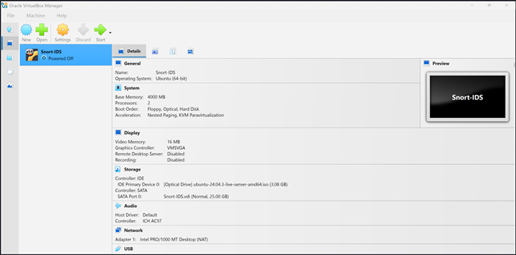
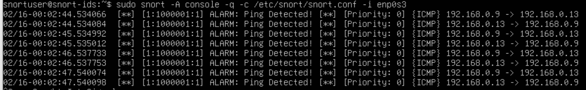

## Intrusion Detection System Deployment with Snort

## Overview

This project documents the deployment of an Intrusion Detection System (IDS) using Snort on an Ubuntu Server virtual machine. The goal was to monitor network traffic on my home lab and generate alerts for specific activities, such as ICMP (ping) requests. Below, I detail each step of the process, from setting up the virtual environment to testing the custom detection rule.

---

## 1. Virtual Machine Setup

I began by downloading **Oracle VirtualBox** from the official website and the **Ubuntu Server 24.04.3 LTS** ISO from Ubuntu's site. Using VirtualBox, I created a new virtual machine with the following specifications:

- **OS Type:** Linux, Ubuntu (64-bit)  
- **CPU:** 2 cores  
- **RAM:** 4 GB  
- **Disk:** 25 GB (dynamically allocated)  

During installation, I selected the Ubuntu Server ISO and completed the standard setup (user account, system updates, etc.).



---

## 2. Network Configuration – The Bridge Trick

For Snort to monitor actual traffic on my local network, the VM needed to see packets not exclusively addressed to itself. I achieved this by configuring the network adapter in **bridged mode** and enabling **promiscuous mode**:

1. In VirtualBox, went to **Settings > Network**.  
2. Changed **"Attached to"** from NAT to **Bridged Adapter**.  
3. Under **Advanced**, set **Promiscuous Mode** to **Allow All**.  

This allows the virtual NIC to capture all traffic passing through the physical interface, which is essential for an IDS.

---

## 3. Linux Preparation

After booting into the newly installed Ubuntu Server, I updated the system and identified the network interface name:

```bash
sudo apt update && sudo apt upgrade -y
ip addr
```

The output showed my interface as **enp0s3** – this name would be used later when starting Snort.

---

## 4. Installing and Configuring Snort

### Installation

Snort was installed directly from Ubuntu’s repository:

```bash
sudo apt install snort -y
```

During installation, a configuration prompt appeared asking for the **home network address range**. I entered my subnet (e.g., **192.168.1.0/24**), which tells Snort which network to consider as "internal."

---

### Modifying the Main Configuration

I edited the main Snort configuration file to define the internal and external networks:

```bash
sudo nano /etc/snort/snort.conf
```

I located the lines:

- **ipvar HOME_NET** – set this to my subnet (e.g., 192.168.1.0/24).  
- **ipvar EXTERNAL_NET** – set to `any` or `!$HOME_NET` (meaning anything not internal).  

---

### Validation

Before running Snort, I tested the configuration for syntax errors:

```bash
sudo snort -T -c /etc/snort/snort.conf
```

The output confirmed:

 

---

## 5. Creating and Testing a Custom Rule

To verify the IDS was working, I added a simple rule that triggers on any ICMP (ping) traffic to the home network.

---

### Step 1: Add the Rule

I opened the local rules file:

```bash
sudo nano /etc/snort/rules/local.rules
```

And inserted the following line (ensuring each option ends with a semicolon):

```text
alert icmp any any -> $HOME_NET any (msg:"ALARM: Ping Detected!"; sid:1000001; rev:1;)
```

---

### Step 2: Enable the Rule in Snort.conf

I checked that the main configuration file included the local rules:

```bash
sudo nano /etc/snort/snort.conf
```

I searched for **local.rules** and confirmed the line was uncommented:

```text
include $RULE_PATH/local.rules
```

---

### Step 3: Run Snort in Console Mode

With the rule in place, I launched Snort to display alerts directly to the console:

```bash
sudo snort -A console -q -c /etc/snort/snort.conf -i enp0s3
```

- **-A console** prints alerts to stdout  
- **-q** suppresses non-alert messages  
- **-c** points to the configuration  
- **-i** specifies the interface  

---

### Step 4: Trigger the Alert

From a separate machine on the same network (in my case, a Windows PC), I pinged the Ubuntu VM’s IP address:

```bash
ping 192.168.0.13
```

Instantly, Snort generated an alerts on the console:

 

---

## Conclusion

This project successfully demonstrated the deployment of a basic IDS using Snort in a virtualized environment. By configuring network bridging and promiscuous mode, the VM was able to monitor live traffic and trigger alerts based on custom rules. This foundation can be extended with more sophisticated rule sets, output logging, and integration with security information and event management (SIEM) tools for deeper network analysis.
